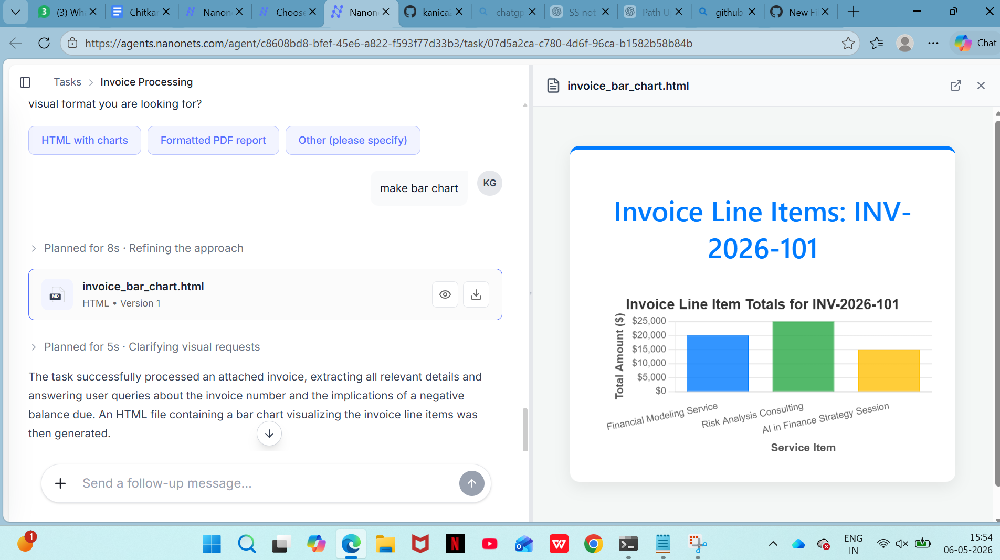

# NanoSet – Question & Answer System

## 📌 Overview

NanoSet is an AI-powered Question & Answer system designed to provide quick, accurate, and intelligent responses to user queries. The project focuses on building a smart platform where users can ask questions and receive relevant answers efficiently.

The system can be used for:

- Educational assistance
- Technical query solving
- Knowledge management
- AI-based chatbot solutions
- Smart FAQ automation

---

# 🚀 Features

- AI-powered question answering
- Fast response generation
- Intelligent query handling
- User-friendly interface
- Search-based answer retrieval
- Real-time interaction
- Scalable architecture

---

# 🛠️ Technologies Used

- Python
- HTML
- CSS
- JavaScript
- AI / NLP Concepts
- Database Integration
- Nanonets AI Agent

---

# 📂 Project Structure

```bash
NanoSet/
│
├── frontend/
├── backend/
├── database/
├── models/
├── static/
├── templates/
├── invoice.png
└── README.md
```

---

# 📸 Project Screenshot

## GitHub README Preview



---

# 📄 Invoice Information Extracted

The AI agent extracts important invoice details such as:

- Invoice Number
- Vendor Name
- Client Name
- Total Amount
- GST Information
- Payment Status

---

# 📊 Service Line Item Visualization

The system can generate visual reports such as:

- Bar chart visualization
- Expense comparison
- Service-wise analysis
- Interactive HTML reports

---

# 🚀 How to Run the Project

## Step 1: Clone the Repository

```bash
git clone YOUR_REPOSITORY_LINK
```

## Step 2: Open Project Folder

```bash
cd NanoSet
```

## Step 3: Run the Project

```bash
python app.py
```

---

# 📈 Example Prompt

```bash
make bar chart
```

The AI agent processes invoice data and generates visual output automatically.

---

# 📂 Output Generated

The project can generate:

- Invoice data extraction
- HTML visualization reports
- Bar chart analysis
- Smart AI-generated responses

---

# 🎯 Learning Outcomes

Through this project, I learned:

- AI-powered automation
- Invoice data extraction
- HTML report generation
- Data visualization
- Working with Nanonets AI Agents
- GitHub project deployment

---

# 📌 Future Improvements

- Add pie chart visualizations
- Export reports as PDF
- Add dashboard analytics
- Automate email notifications
- Store invoice data in database

---

# 👩‍💻 Author

**Kanica**

---

# ⭐ GitHub Upload Commands

```bash
git init
git add .
git commit -m "Added NanoSet Question & Answer System"
git branch -M main
git remote add origin YOUR_REPOSITORY_LINK
git push -u origin main
```

---

# 📎 Note

This project is created for educational and learning purposes to demonstrate AI-powered automation, intelligent question answering, and invoice visualization using Nanonets AI Agents.
